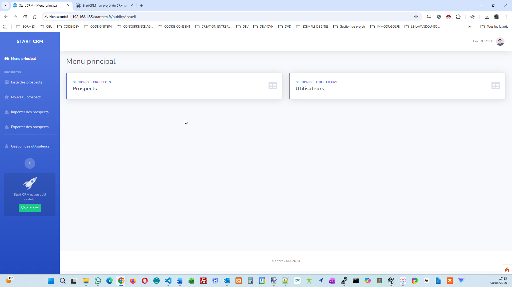
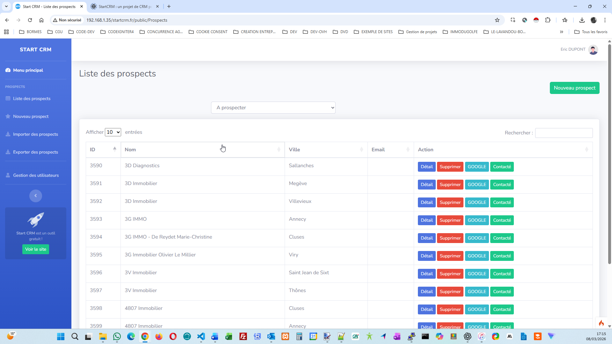
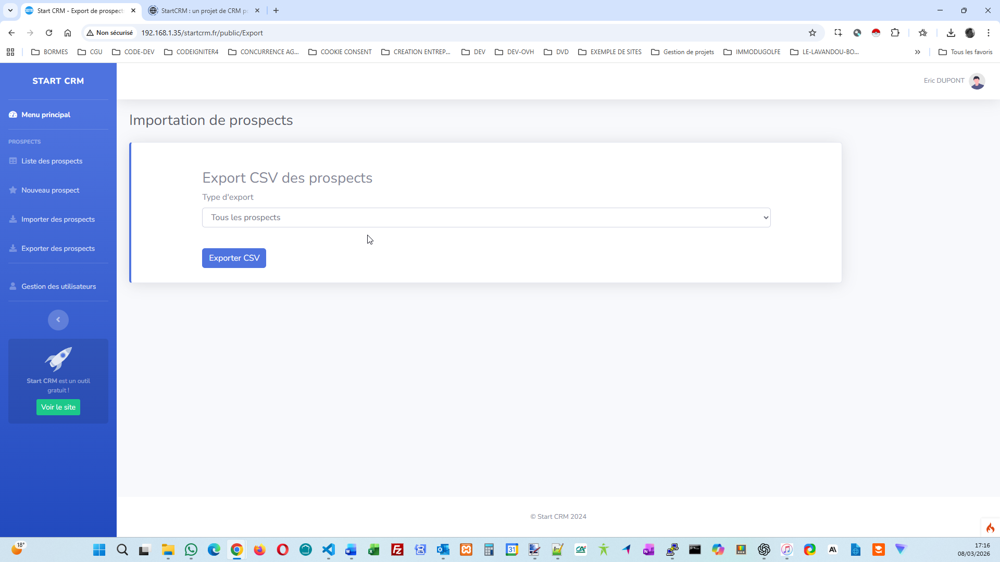

StartCRM - French

Description

StartCRM est un CRM simple et léger développé avec PHP et CodeIgniter 4.
Il permet de gérer facilement des prospects, suivre les contacts et exporter les données.

http://startcrm.online.fr

Fonctionnalités

Gestion des prospects

Suivi des contacts

Export CSV

Interface simple et rapide

Assistant d'installation web

Prérequis

PHP 8.1 ou supérieur

MySQL / MariaDB

Composer

Apache ou Nginx

Installation
1. Cloner le projet
git clone https://github.com/aastephan/startcrm.git
2. Installer les dépendances
composer install
3. Configurer le serveur web

Le serveur web doit pointer vers le dossier public/.

Exemple :

http://votre-serveur/startcrm/public
4. Lancer l'installation

Ouvrez votre navigateur et allez à l'adresse :

http://votre-serveur/startcrm/install

L'assistant vous guidera pour :

configurer la base de données

créer le compte administrateur

finaliser l'installation

5. Accéder à l'application

Une fois l'installation terminée :

http://votre-serveur/startcrm
Base de données

Le schéma de la base de données se trouve dans :

database/startcrm.sql

Il est automatiquement importé lors de l'installation.

## Screenshots

### Dashboard

### Prospects

### Export

Licence

Ce projet est open source sous licence MIT.

Auteur

Alain Stephan
Développeur web

StartCRM - English

StartCRM is a simple and lightweight CRM built with PHP and CodeIgniter 4.
It allows you to manage prospects, track contacts and export data easily.
http://startcrm.online.fr

Features

Prospect management

Contact tracking

CSV export

Simple and fast interface

Web installer

Requirements

PHP 8.1+

MySQL / MariaDB

Composer

Apache / Nginx

Installation
1. Clone the repository
git clone https://github.com/aastephan/startcrm.git
2. Install dependencies
composer install
3. Configure your web server

Point your web server to the public/ directory.

Example:

http://your-server/startcrm/public
4. Run the installer

Open your browser and go to:

http://your-server/startcrm/install

The installer will guide you through:

database configuration

administrator account creation

initial setup

5. Login

After installation, access the CRM from:

http://your-server/startcrm
Database

The database schema is located in:

database/startcrm.sql

It is automatically imported during the installation process.

## Screenshots

### Dashboard

### Prospects

### Export

License

This project is open-source and available under the MIT License.

Author

Alain Stephan
Web developer

